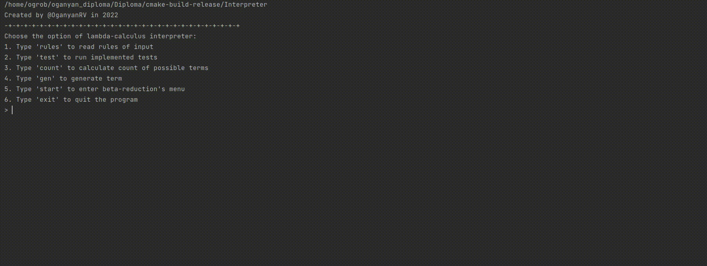
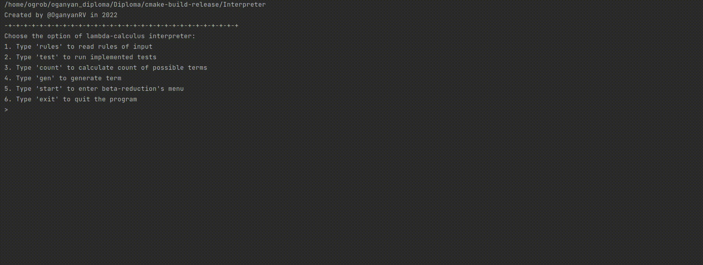

# Lambda-calculus-interpreter
Thesis work of [Oganyan Robert](https://t.me/robasti). Fourth (final) year of study, 8th term.

In this project we work with terms with help of an abstract syntax tree.

The lambda calculus interpreter has such functions:

1. Generating the number of possible terms and generate *k*-th random term.
2. Checking the correctness of the beta reductions with tests.
3. Replacing combinators with their representation in terms.
4. Doing beta-reduction procedure to the input term in different reduction strategies (normal strategy, call by name, call by value).

Also I did some experiments on all possible closed lambda terms and wrote the papers  about that:

1. ["Analysis of normal forms in lambda calculus"](https://medium.com/@Robasti/analysis-of-normal-forms-in-lambda-calculus-2de201df933d) 
2. ["Comparison of different reduction (evaluation) strategies"](https://medium.com/@Robasti/comparison-of-different-reduction-evaluation-strategies-9c8933f9b882)

Implemented with C++17, JetBrains Clion.

## Work demonstration

Rules of beta-reduction interpreter.

Running written tests.

Counting all possible terms.

Generating k-th random term.

Making beta-reduction in different strategies. The interpreter also supports 2 types of input.

